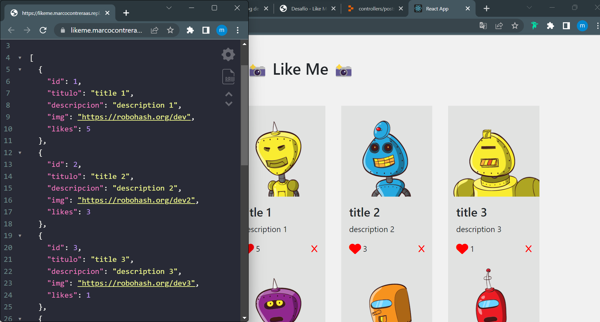

## PASOS DE CONFIGURACIÓN

### BACKEND

- entrar en el directorio **backend**
- instalar dependencias
- modificar valores de conexión
- abrir el cliente psql y ejecutar las sentencias DDL en sql
- leventar el servidor


### FRONTEND

- entrar en el directorio **frontend**
- abrir el archivo index.html con el navegador o servidor web local

### DEMO 

- entra a la plataforma de replit solo para que se ejecute el servidor.
- entra a la plataforma de netlify para interactuar con la base de datos.

[](https://likeme.marcocontreraas.repl.co/posts)
[](https://aquamarine-halva-e05f0f.netlify.app/)

---

Entrar al proyecto de **backend** e instalar dependencias

```bash
cd backend
npm install
```

Modificar los valores en el archivo `backend/config.js`, según corresponda.  

Ej:  

```js
module.exports = {
    PORT: process.env.PORT || 3000,
    DB_USER: process.env.DB_USER || 'su-usuario',
    DB_PASSWORD: process.env.DB_PASSWORD || 'su-password',
    DB_HOST: process.env.DB_HOST || 'localhost',
    DB_DATABASE: process.env.DB_DATABASE || 'likeme',
    DB_PORT: process.env.DB_PORT || 5432
}
```

Abrir el cliente de terminal **psql** y ejecutar el siguiente script:  

```sql
CREATE DATABASE likeme;
\c likeme
CREATE TABLE posts (id SERIAL, 
    titulo VARCHAR(25), 
    img VARCHAR(1000), 
    descripcion VARCHAR(255), 
    likes INT
);
```
> Este script, también se encuentra en : `backend/sql/schema.sql`


**Levantar el servidor**

Ejecutar con node

```bash
node backend/index.js
```

Corriendo el script definido en `backend/package.json`

```bash
npm start
```

> Puede usar el servidor de desarrolo con **hot-reaload** con `npm run dev`


---

Entrar al proyecto de **frontend** y abrir el archivo **index.html** con cualquier navegador o desde algún servidor web local


### SCREENSHOT 




